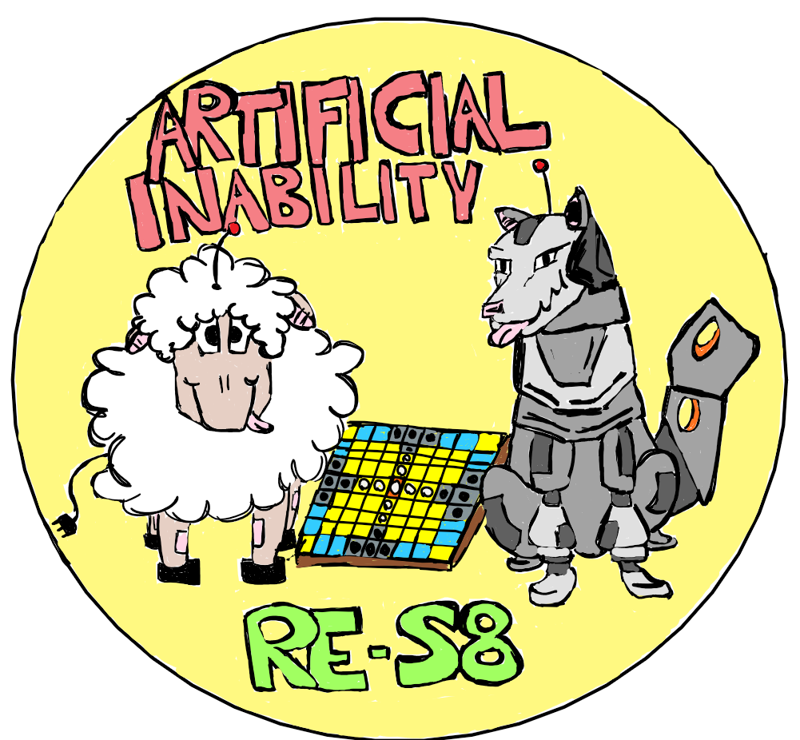

# Tablut2022_Artificial_Inability

Artificial Inability is an artificial intelligence project for the Tablut Game Competition organized by the Fondamenti di Intelligenza Artificiale M 2022 course at the Unibo.

   

