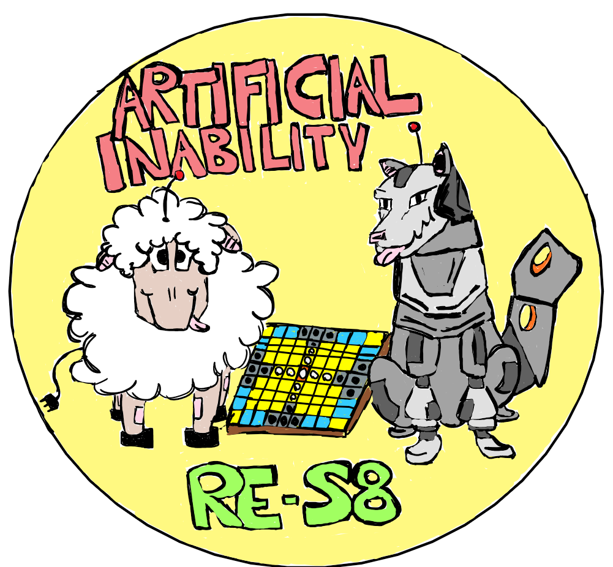

# :chess_pawn: Artificial Inability :chess_pawn:

<p align="center">
   
</p>

Artificial Inability is a Java-based intelligent agent created to take part in the 2022 Tablut competition of the Fundamentals of Artificial Intelligence course held by Prof. Paola Mello and Prof. Federico Chesani at the University of Bologna.

## How to run
You can download the .jar file located [here](https://github.com/giorgio-mocci/Tablut2022_Artificial_Inability/tree/main/Tablut/Executables) and run it like this:
```
java -jar AInabilityClient.jar <BLACK|WHITE> <timeout-in-seconds> <server-ip> <debug(optional)>
```

## Team: Artificial Inability
- [Giorgio Mocci](https://github.com/giorgio-mocci)
- [Giuseppe Sergi](https://github.com/GiuseppeSergi3)
- [Marco Motamed](https://github.com/MotaMarco)
- [Luca Berardi](https://github.com/LucaBerardi6)

## Credits
- Logo by [Giuseppe Sergi](https://github.com/GiuseppeSergi3)
- [Basic software](https://github.com/AGalassi/TablutCompetition) provided by [Andrea Galassi](https://github.com/AGalassi) 
